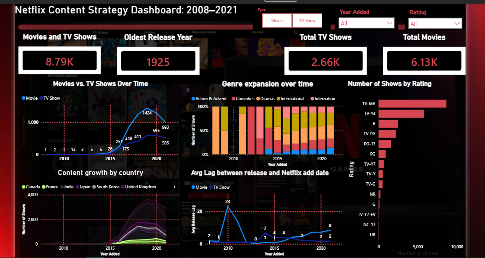

# ifeanalyst17.github.io
### 🎬 Netflix Content Strategy & Growth Analysis

**Tools:** Python (Pandas, Datetime Parsing), Power BI (DAX, Power Query), GitHub

* Cleaned and engineered 8,800+ raw Netflix catalog titles in Python, resolving missing values and parsing custom date features.
* Calculated a custom DAX **Release Lag** measure demonstrating how Netflix shifted from legacy content licensing to fresh originals (reducing lag down to ~1–2 years).
* Designed an interactive executive dashboard visualizing global content distribution across major markets (US, UK, India, Japan, South Korea).

[View Netflix Project Repository](https://github.com/ifeanalyst17/netflix-content-analysis)
